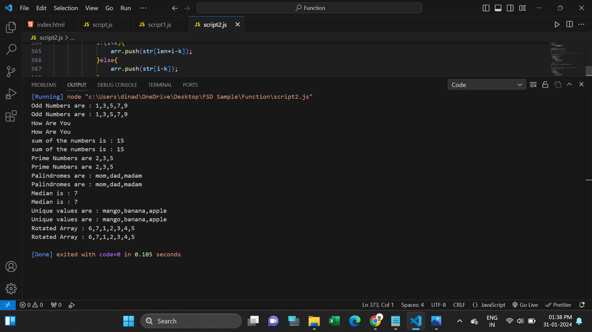
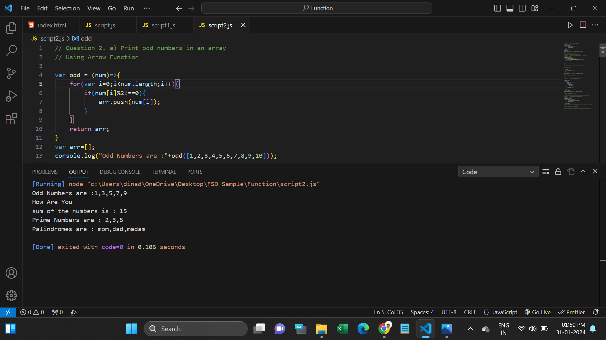

<h1>Functions Task</h1>
<h2>1. Do the below programs in anonymous function & IIFE</h2>

a) Print odd numbers in an array

b) Convert all the strings to title caps in a string array

c) Sum of all numbers in an array

d) Return all the prime numbers in an array

e) Return all the palindromes in an array

f) Return median of two sorted arrays of the same size.

g) Remove duplicates from an array

h) Rotate an array by k times

<h2>2. Do the below programs in arrow functions.</h2>

a) Print odd numbers in an array

b) Convert all the strings to title caps in a string array

c) Sum of all numbers in an array

d) Return all the prime numbers in an array

e) Return all the palindromes in an array

I solved these Questions using Anonymous, IIFE and Arrow Functions. 

I'm using Anonymous and IIFE Function in script file.

I'm using Arrow Function in script1 file.

I have declared result in commands at end of the question.

Every file output screenshots attached in below:

<h2>Screenshots</h2>

1. Script.js Result:

 

2. Script1.js Result:

